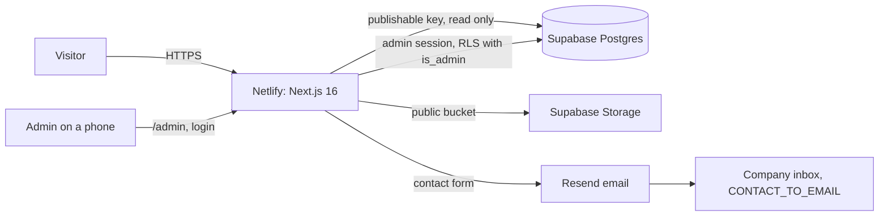

# Architecture

One Next.js application serves the public site and the admin console. Supabase holds the data, the photos and the admin account. Netlify builds and hosts it. Resend delivers contact form email. Nothing else.



Text version:

```
Visitor / Admin  ->  Netlify (Next.js app: pages, proxy, server actions, upload route)
                          |-> Supabase Postgres  (projects, photos, settings, messages, admin_users)
                          |-> Supabase Storage   (project-images bucket, public read, admin write)
                          |-> Supabase Auth      (admin login, password reset)
                          '-> Resend             (contact form email to CONTACT_TO_EMAIL)
```

Two addresses, two jobs, both set in the environment and never in code:

- `ADMIN_EMAILS`: who may log into `/admin` (chaidezjason@gmail.com). Also registered in the `admin_users` table.
- `CONTACT_TO_EMAIL`: where contact form messages go (luisjacinto1107@gmail.com).

## Frontend

- Next.js 16 App Router, TypeScript, React 19.
- Plain CSS: design tokens in `src/styles/globals.css`, CSS Modules per component, a small global stylesheet for the admin. No utility framework, so the aesthetic file drives the look instead of framework defaults.
- Fonts are self hosted (Inter, EB Garamond, JetBrains Mono, variable woff2 in `src/fonts`) through `next/font/local`. No third party requests on the public site.
- Client JavaScript is limited to small islands: header and menu, language prompt, reveal on scroll, project index hover preview, gallery lightbox, contact form, admin forms, photo upload. Every page renders complete HTML on the server and still reads without JavaScript.

## Languages

- `/` is English, `/es` is Spanish. The file structure is `src/app/[locale]/...`; `src/proxy.ts` rewrites unprefixed paths to the `en` segment so English URLs stay clean and `/en/...` redirects back.
- The header carries a persistent switch that reads `Español` on the English site and `English` on the Spanish site, full words, same size as the navigation, present on every page and again in the footer.
- A first visit shows a bilingual prompt. The choice is a one year cookie named `lang`. A Spanish preference redirects the root site to `/es`. Any link with `?lang=en` or `?lang=es` sets the cookie server side, so switching works without JavaScript.
- Interface strings live in `src/lib/i18n/en.ts` and `es.ts`. Project and settings content has optional Spanish fields (name, description, location, scope); an empty Spanish field falls back to English (`pick()` in `src/lib/i18n`). Money stays in USD in both languages.
- Search engines get `hreflang` alternates, a canonical per language and both languages in the sitemap.

## Rendering model

- Home, About, Contact and every project page are prerendered and revalidated every five minutes (`export const revalidate = 300`). Admin saves also call `revalidatePath('/', 'layout')`, so a published change is visible right away.
- The Projects index reads its one filter from the URL (`?year=2024`) and renders on demand. The year list is computed from published projects, so only years with work appear. Filter states are shareable links and work without JavaScript.
- The admin console is fully dynamic and never cached.
- `sitemap.xml` and `robots.txt` are generated from the database.

## Data layer

`src/lib/data/types.ts` defines the shapes. `src/lib/data/index.ts` picks a provider:

- `local.ts` (demo mode): a JSON file in `.local-data/` plus a media folder. Used when the Supabase variables are empty. The admin console is enabled in demo mode only for `next dev`; a production build without Supabase shows "Admin is not set up yet".
- `supabase.ts`: Postgres through `@supabase/supabase-js`. Public reads use the publishable key with no session. Admin reads and writes use the logged in user's session, so row level security applies to every query. `isAdmin()` calls the database function of the same name.

Both providers implement the same interface, so pages and actions do not know which one they are talking to.

Project ordering, everywhere: year descending, then `display_order` ascending inside the year, then newest created first. The arrows on the admin Projects list only move a project within its year (`sortProjects` in `local.ts`, the same three `order()` calls in `supabase.ts`).

A project carries one `description`. The short preview used by lists and the home page is `short_description`, generated on every save by `makeExcerpt()` (first paragraph, whole sentences up to about 160 characters). It is never typed by hand.

`project_value` is `numeric(14,2)`, null when unknown. The admin accepts plain digits (`185000`, also `185,000` or `$185000`); `parseMoney()` normalises them. The site formats it with `Intl.NumberFormat('en-US', { style: 'currency', currency: 'USD', maximumFractionDigits: 0 })` and renders the row only when a value exists.

## Database

Five tables, defined in `database/migrations/0001_init.sql` and `0002_v2_corrections.sql` (run in that order, both are safe to run twice):

- `projects`: name, slug, year, location (English plus optional Spanish), `project_value`, description (English plus optional Spanish) with the generated short description, scope, featured, published, display order, cover image, `is_demo`. `project_type` is nullable, has no default and is not used by the site or the admin; it stays for compatibility. `neighborhood` and `completion_date` remain as columns from the first version but nothing reads or writes them.
- `project_images`: storage keys for three sizes, alt text, caption, width, height, group (gallery, before, after), order. `project_id` is null for site images such as an uploaded hero photo.
- `site_settings`: one row (`id = 1`) with company details, home page copy, About copy, contact copy, services list, meta description, social links, hero and About image, logo and favicon overrides.
- `contact_messages`: name, phone or email, message, language.
- `admin_users`: `user_id` (references `auth.users`), `email`, `created_at`. The allow list that the database itself enforces.

`public.is_admin()` is a `security definer` SQL function that returns whether `auth.uid()` is in `admin_users`. Every administrative policy on `projects`, `project_images`, `site_settings`, `contact_messages` and `storage.objects` uses `using (public.is_admin()) with check (public.is_admin())`. Being authenticated is not enough: a Supabase user who is not in `admin_users` can read nothing beyond what an anonymous visitor sees and can write nothing. Anonymous visitors read published projects, their photos and the settings, and may insert a contact message.

`npm run admin:create -- chaidezjason@gmail.com "password"` creates the Auth user and the `admin_users` row in one step. The application adds a second check (`ADMIN_EMAILS` plus `is_admin()` after login) so a stray account is signed out before it sees the console. Public sign ups must still be turned off in Supabase Auth; the docs say so.

## Storage and images

- One public bucket, `project-images`. Keys look like `projects/{projectId}/{imageId}-full.jpg`, `-medium.jpg`, `-thumb.jpg`. Sample projects point at `public:placeholders/...` which resolves to files in `public/`.
- Intake (`src/lib/images/client.ts`): the browser looks at the file's type, extension and the `ftyp` brand in the first bytes. HEIC and HEIF files are converted to JPEG first with `heic-to` (libheif compiled to WebAssembly, LGPL). The library is imported dynamically only when such a file shows up, so the roughly 3 MB decoder is a separate chunk that never loads for JPEG uploads or for visitors. If a browser cannot decode a file that did not look like HEIC, the same conversion is tried once before giving up.
- Then the existing pipeline: decode with EXIF orientation applied, encode JPEG at 2400, 1200 and 480 px on the long edge (quality 0.86, 0.84, 0.82). Location data and other metadata are dropped by the re-encode. Originals never leave the phone, which keeps uploads fast and under the 6 MB body limit of the hosting functions.
- Several photos can be selected at once; they are prepared and uploaded one after another with a visible counter. The first photo of a project becomes the cover automatically. Alt text defaults to `{Project name}, project photo {N}` until someone writes a better one.
- `POST /api/admin/upload` checks the session and the admin list, checks that the parent project exists, validates types and sizes, stores the three files and writes the `project_images` row. In demo mode files go to `.local-data/media` and are served by `/api/local-media/...`.
- The public site uses `` with the three sizes, explicit `width` and `height` (no layout shift), lazy loading below the fold and eager loading for the hero and the project cover. Image optimisation does not depend on the host.

## Authentication

- Supabase Auth, email and password. Sessions are cookies managed by `@supabase/ssr`.
- `src/proxy.ts` refreshes the session on every `/admin` request, verifies the JWT with `getClaims()` and redirects to `/admin/login` when there is none. Server actions, pages and the upload route check again with `getUser()`, then `isEmailAllowed()` against `ADMIN_EMAILS`, then `is_admin()` in the database (`src/lib/admin/auth.ts`). A logged in user who fails either check is signed out and sent back to the login page with a message.
- Password reset: the login page sends a reset email; the link lands on `/admin/auth/callback`, which exchanges the code for a session and opens `/admin/reset`.
- Logout clears the session and returns to the login page.

## Publishing flow

1. New project: name only. A draft row is created and the editor opens.
2. Main form: year, project value (optional), location, description. Nothing else is required.
3. Photos: select all of them at once from the camera roll. They are converted if needed, resized, uploaded one by one with a counter. The first photo is the cover; any photo can be set as cover; arrows or drag change the order.
4. Publish. Location and description are required at this point, not before. The project appears on the site within seconds. Unpublish hides it; the URL returns 404.
5. Optional, any time later: the web address (slug, generated from the name; it stops following the name once the project is published so links keep working), scope of work, the featured switch, a Spanish translation, per photo alt text, caption and before or after grouping.
6. Featured projects show in the selected work section on the home page. When nothing is featured the home page shows the newest projects instead.

## Contact

The contact form has three fields: name, phone or email, message. It is a server action. It validates, stores the message in `contact_messages` (always) and emails `CONTACT_TO_EMAIL` through Resend (when `RESEND_API_KEY` is also set). `buildContactEmail()` in `src/lib/email.ts` reads the recipient from the environment it is given, which is what the unit test checks. If email delivery fails the message is still in the admin console under Messages. Spam control: a hidden honeypot field and a minimum time between page load and submit. Phone and email links (`tel:`, `mailto:`) sit next to the form and in the header and footer.

## Security

- No secrets in the repository. The secret key is only used by the scripts in `scripts/`.
- Row level security on every table and on the storage bucket, all admin policies gated by `is_admin()`. `tests/db/rls.sql` proves it against a local Postgres: anonymous reads published rows only, an authenticated stranger reads and writes nothing, the registered admin can do everything.
- Upload route: admin only, JPEG only for photos, size caps, dimension caps, project must exist.
- Security headers in `next.config.ts` (nosniff, frame options, referrer policy, permissions policy).
- The admin is `noindex` and excluded in `robots.txt`.
- Form inputs are length limited and escaped in email HTML.

## Deployment

Netlify, from a Git repository, with the environment variables from `.env.example`. `netlify.toml` holds the build command and the Node version and nothing else; Netlify detects Next.js on its own. See `docs/DEPLOYMENT.md`. Nothing in the code is Netlify specific, so the app also runs on any Node host that supports Next.js.

## Why this shape

- Supabase gives Postgres, auth and file storage in one free project with no server to run.
- Netlify's free plan allows commercial sites, builds from Git and runs Next.js server features. Vercel's free plan does not allow commercial use.
- Browser side conversion and resizing avoid image processing servers and paid image services, and keep phone originals off the wire.
- Demo mode means the site can be reviewed and the admin can be tried before a single account exists, and the browser tests run without external services.

## Intentionally not built

- No page builder. Layout and structure are fixed in code; content is editable.
- No project categories or taxonomy. Browsing is by year only.
- No photo analysis, automatic titles or descriptions. Titles, descriptions, cover and order are entered by hand, which also suits preparing them outside the site and pasting them in.
- No comments, ratings, testimonials or fake statistics.
- No analytics or third party scripts.
- No automatic machine translation. Spanish fields are written by people; English is the fallback.
- No image CDN. Three fixed sizes cover phones, tablets and desktops.
- No multi user roles. One admin, listed in `admin_users`.
